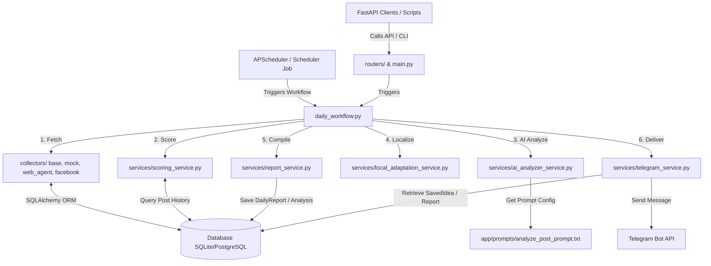
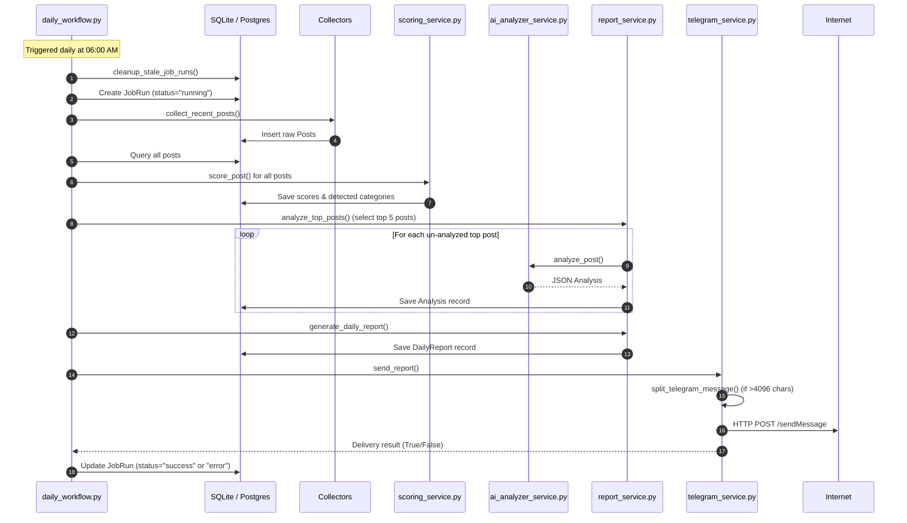

# Advice Content Radar Project Map

This document lists all directories, source files, classes, major functions, API endpoints, and models in the project, as well as Mermaid diagrams to visualize their dependencies.

---

## 1. Project Directory Structure

```text
advice-content-radar/
├── app/
│   ├── collectors/              # Data collection modules
│   │   ├── __init__.py
│   │   ├── base_collector.py    # ABC interface for all collectors
│   │   ├── facebook_cloak_collector.py
│   │   ├── facebook_graph_collector.py
│   │   ├── manual_import_collector.py
│   │   ├── mock_collector.py
│   │   └── web_agent_collector.py
│   ├── jobs/                    # Orchestrator & scheduling
│   │   ├── __init__.py
│   │   ├── daily_workflow.py
│   │   └── scheduler.py
│   ├── models/                  # SQLAlchemy ORM models
│   │   ├── __init__.py
│   │   ├── analysis.py
│   │   ├── content_memory.py
│   │   ├── job_run.py
│   │   ├── post.py
│   │   ├── report.py
│   │   ├── saved_idea.py
│   │   └── source.py
│   ├── prompts/                 # Prompt templates
│   │   └── analyze_post_prompt.txt
│   ├── routers/                 # FastAPI routes
│   │   ├── __init__.py
│   │   ├── ideas.py
│   │   ├── jobs.py
│   │   ├── posts.py
│   │   ├── reports.py
│   │   └── sources.py
│   ├── schemas/                 # Pydantic models (DTOs)
│   │   ├── __init__.py
│   │   ├── post_schema.py
│   │   ├── report_schema.py
│   │   ├── source_schema.py
│   │   └── telegram_schema.py
│   ├── services/                # Business logic services
│   │   ├── __init__.py
│   │   ├── ai_analyzer_service.py
│   │   ├── collector_service.py
│   │   ├── local_adaptation_service.py
│   │   ├── memory_service.py
│   │   ├── report_service.py
│   │   ├── scoring_service.py
│   │   ├── source_health_service.py
│   │   ├── telegram_command_service.py
│   │   └── telegram_service.py
│   ├── config.py                # Configuration (pydantic-settings)
│   ├── database.py              # DB Engine & session manager
│   ├── __init__.py
│   ├── main.py                  # Entrypoint / FastAPI application
│   └── security.py              # Header keys validation & webhook auth
├── backups/                     # Directory for DB backups (ignored)
├── data/                        # CSV templates and mock source configs
│   ├── facebook_cloak_sources.json
│   ├── facebook_competitor_posts_template.csv
│   ├── facebook_sources.json
│   ├── manual_import_template.csv
│   └── web_sources.json
├── migrations/                  # SQLite migration records
├── scripts/                     # Operational scripts and command line tools
│   ├── backup_sqlite.py
│   ├── create_manual_template.py
│   ├── import_manual_data.py
│   ├── import_web_sources.py
│   ├── migrate_sqlite_to_postgres.py
│   ├── run_daily_report.py
│   ├── source_health_report.py
│   └── telegram_ops.py
└── tests/                       # Pytest test suite
    ├── test_commands.py
    ├── test_facebook_cloak_collector.py
    ├── test_facebook_graph_collector.py
    ├── test_operational_hardening.py
    ├── test_ranking.py
    ├── test_report.py
    ├── test_scoring.py
    ├── test_security_hardening.py
    └── test_web_agent_collector.py
```

---

## 2. API Endpoints & Routes

All routes (except `/health` and `/telegram/webhook`) require `X-Admin-API-Key` in the request header if `ADMIN_API_KEY` is set in `.env`.

| HTTP Method | Path | Router | Auth / Security | Description |
|---|---|---|---|---|
| **GET** | `/health` | `main.py` | None | Service check endpoint |
| **POST** | `/telegram/webhook` | `main.py` | `X-Telegram-Bot-Api-Secret-Token` | Handles incoming webhook commands from Telegram |
| **GET** | `/sources/health` | `sources.py` | Admin Key | Returns health status of all data sources |
| **GET** | `/sources` | `sources.py` | Admin Key | Lists registered sources |
| **POST** | `/sources` | `sources.py` | Admin Key | Registers a new source |
| **PUT** | `/sources/{source_id}` | `sources.py` | Admin Key | Updates a source configuration |
| **DELETE** | `/sources/{source_id}` | `sources.py` | Admin Key | Deletes a source |
| **GET** | `/posts` | `posts.py` | Admin Key | Lists collected posts |
| **GET** | `/posts/top` | `posts.py` | Admin Key | Lists top-rated posts sorted by `final_score` |
| **GET** | `/posts/{post_id}` | `posts.py` | Admin Key | Gets a single post |
| **GET** | `/reports/today` | `reports.py` | Admin Key | Returns today's generated report |
| **GET** | `/reports` | `reports.py` | Admin Key | Lists past generated reports |
| **GET** | `/reports/{report_id}` | `reports.py` | Admin Key | Gets a single report |
| **POST** | `/reports/generate` | `reports.py` | Admin Key | Manually triggers report compilation |
| **POST** | `/reports/send-telegram` | `reports.py` | Admin Key | Sends the latest report to Telegram |
| **GET** | `/ideas/saved` | `ideas.py` | Admin Key | Lists saved ideas |
| **POST** | `/ideas/save` | `ideas.py` | Admin Key | Saves an idea by its index number |
| **POST** | `/ideas/{idea_id}/used` | `ideas.py` | Admin Key | Marks a saved idea as used |
| **POST** | `/jobs/collect` | `jobs.py` | Admin Key | Runs collection collectors |
| **POST** | `/jobs/score` | `jobs.py` | Admin Key | Triggers score recalculation |
| **POST** | `/jobs/analyze` | `jobs.py` | Admin Key | Triggers AI analysis of top posts |
| **POST** | `/jobs/full-daily-run` | `jobs.py` | Admin Key | Runs the full daily orchestration |

---

## 3. Database Schema Mapping (SQLAlchemy Models)

* **`Source`** (`sources`):
  * `id` (Integer, PK)
  * `name` (Text, non-nullable)
  * `platform` (Text, non-nullable)
  * `source_url` (Text, non-nullable, unique `uq_sources_source_url`)
  * `source_type` (Text, non-nullable)
  * `category` (Text, nullable)
  * `location` (Text, nullable)
  * `priority_score` (Integer, default `50`)
  * `active` (Boolean, default `True`)
  * `created_at` / `updated_at` (DateTime)
  * Relationships: `posts` (one-to-many with `Post`)
* **`Post`** (`posts`):
  * `id` (Integer, PK)
  * `source_id` (Integer, FK `sources.id`)
  * `post_url` (Text, unique, non-nullable)
  * `post_text` (Text, nullable)
  * `media_url` (Text, nullable)
  * `posted_at` (DateTime, nullable)
  * `collected_at` (DateTime, default `func.now()`)
  * `like_count` / `comment_count` / `share_count` / `view_count` (Integer)
  * `raw_viral_score` / `normalized_score` / `local_relevance_score` / `final_score` (Float)
  * `detected_product_category` / `detected_content_type` (Text, nullable)
  * Relationships: `source` (belongs-to `Source`), `analysis` (one-to-one with `Analysis`)
* **`Analysis`** (`analyses`):
  * `id` (Integer, PK)
  * `post_id` (Integer, FK `posts.id`, unique `uq_analyses_post_id`)
  * `hook` / `content_type` / `pain_point` / `why_it_worked` / `local_angle` / `suggested_hook` / `caption_draft` / `creative_direction` / `sales_bridge` / `cta` (Text)
  * `hook_type` / `engagement_trigger` / `risk` (JSON arrays)
  * Relationships: `post` (belongs-to `Post`)
* **`DailyReport`** (`daily_reports`):
  * `id` (Integer, PK)
  * `report_date` (Date, unique)
  * `summary` (Text, lists top categories)
  * `top_posts` (JSON list of serialized post analysis details)
  * `recommended_actions` (JSON map for sales, knowledge, reels)
  * `best_hooks` (JSON list of text hooks)
  * `telegram_message` (Text brief)
  * `telegram_sent_at` (DateTime, nullable)
* **`SavedIdea`** (`saved_ideas`):
  * `id` (Integer, PK)
  * `report_id` (Integer, FK `daily_reports.id`)
  * `post_id` (Integer, FK `posts.id`, nullable)
  * `idea_number` (Integer, composite unique key with `report_id`: `uq_saved_ideas_report_number`)
  * `title` / `local_angle` / `suggested_hook` / `caption_draft` / `creative_direction` (Text)
  * `status` (Text, default `"saved"`)
  * `used_at` (DateTime, nullable)
* **`ContentMemory`** (`content_memory`):
  * `id` (Integer, PK)
  * `idea_text` / `hook` / `product_category` / `content_type` (Text)
  * `used` (Boolean, default `False`)
  * `used_at` (DateTime, nullable)
* **`JobRun`** (`job_runs`):
  * `id` (Integer, PK)
  * `job_name` (Text)
  * `status` (Text, default `"running"`)
  * `result` (JSON, nullable metadata)
  * `error` (Text, nullable stack message)
  * `started_at` / `finished_at` (DateTime)

---

## 4. Main Services & Business Logic Functions

### `collector_service.py`
* **`collect_recent_posts(db, hours)`**: Main collector trigger. Checks `MOCK_MODE` setting, calling either `MockCollector` or extending from `WebAgentCollector`, `FacebookGraphCollector`, and `FacebookCloakCollector`.

### `scoring_service.py`
* **`calculate_viral_score(...)`**: Returns weighted raw metric count.
* **`detect_categories(text)`**: Identifies category keywords (RAM, CCTV, Router).
* **`local_relevance_score(text)`**: Looks up product match keywords and penalizes low relevance (memes/dramas).
* **`freshness_score(posted_at)`**: Reduces value over time elapsed.
* **`novelty_score(text, recent_ideas)`**: Computes similarity using overlap against active content memory.
* **`final_score(normalized, local, fresh, novel)`**: Calculates combined weighted score.

### `ai_analyzer_service.py`
* **`analyze_post_with_ai(post, source_name)`**: Runs LLM chat completions to format JSON.
* **`mock_analyze_post(post, source_name)`**: Fallback generator for offline states.

### `local_adaptation_service.py`
* **`adapt_for_advice(analysis)`**: Modifies details for Advice Sam Roi Yod context.

### `report_service.py`
* **`analyze_top_posts(db, limit)`**: Pulls the highest scoring un-analyzed posts and saves `Analysis` entries.
* **`generate_daily_report(db)`**: Assembles daily report briefings.
* **`build_morning_brief(...)`**: Compiles textual Thai layout for Telegram message.

### `telegram_service.py`
* **`send_telegram_message(text)`**: Dispatches messages to Telegram Bot endpoint. Handles chunking.
* **`handle_command(db, text)`**: Routing entry point mapping Telegram commands (e.g. `/today`, `/caption`, `/carousel`, `/reels`, `/save_idea`, `/used`, `/more`) to rendering functions.

---

## 5. System Architecture Diagrams

### Component Interactions



### Daily Workflow Step-by-Step Sequence


